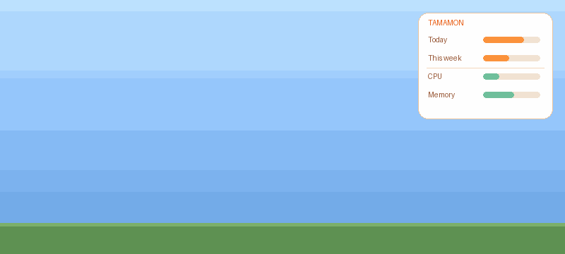
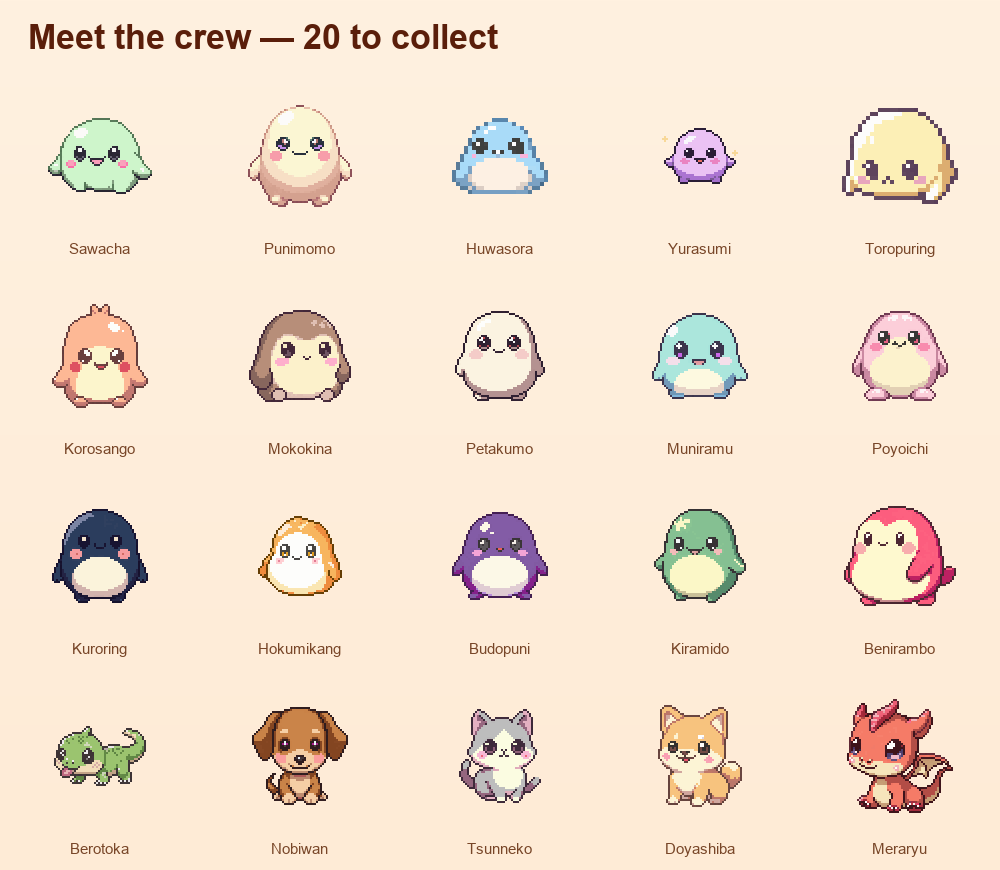

# Tamamon — Releases

**Tamamon** is a macOS desktop pet that grows as you code with Claude Code.
It hatches from an egg, grows and evolves, and roams your whole desktop — with a glanceable
panel showing your local coding activity plus CPU and Memory. Local-only: nothing leaves your Mac.

**Website:** https://tamamons.com

## Install
1. Download **`Tamamon.dmg`** from the [latest release](../../releases/latest).
2. Open it and drag **Tamamon** into **Applications**.
3. Launch it — that's it.

## Requirements
macOS 15+ · Apple Silicon. Signed & notarized (Apple Developer ID) — no scary warnings.

## Collect all 20

## Privacy
Tamamon reads only your **local** Claude Code activity, on your Mac. By default it makes
**no network calls at all** — nothing is uploaded, no account, no tracking. It shows local
coding activity and system load, **not** your Claude subscription limits.

---
This repository hosts **release binaries only** — the app source is private.
